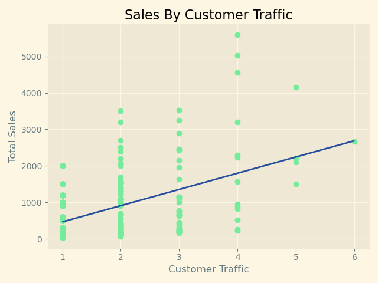

# Data Analysis Notes

Link:

- [Supported TeX/LaTeX commands](https://docs.mathjax.org/en/latest/input/tex/macros/index.html)

Table of contents:

- [Data Analysis Notes](#data-analysis-notes)
  - [Data Preprocessing](#data-preprocessing)
    - [Data Preprocessing Scripts](#data-preprocessing-scripts)
  - [校務研究 Institutional Research](#校務研究-institutional-research)
  - [學習成效分析](#學習成效分析)
  - [相關分析](#相關分析)
    - [Pearson product-moment correlation coefficient](#pearson-product-moment-correlation-coefficient)
  - [Linear Regression](#linear-regression)

## Data Preprocessing

> Data Preprocessing是指將row data轉換成對於分析或模型訓練更適合的格式。

### Data Preprocessing Scripts

1. [檢查特殊字元及置換](./scripts/special_char.py): 應用於姓名特殊字元的置換作業。
2. [迴圈製作折線圖](./scripts/data_visualization_line_chart.py): 批量製作多個學系的折線圖。
3. [資料清理與串接](./scripts/data_cleasing_01.py): 將學生學籍資料、修課紀錄與成績等多個檔案進行串接與清理。
4. [製作多組測試數據的(溫度-時間)折線圖](./scripts/temperature_variation.py): 將[HWiNFO](https://www.hwinfo.com/) Output數據製作成折線圖。

## 校務研究 Institutional Research

在校務研究中所分析的議題主要包含:

1. 學習成效分析
2. 面試/實作成績與入學後學習表現之**相關分析**

## 學習成效分析

目的: 瞭解不同組別的學生，在特定的課程中，其學習表現是否具有顯著差異。

Example: 依據學生英文能力，將每一個學系的學生分為2組，並分析2組學生修讀EMI(全英文授課)之課程是否具有顯著差異。

分析方法: 原先採用**Student's t-test**進行分析，但由於各學系的samples低於30，因此改為依照下列條件進行對應的分析:

1. 當samples >= 30、為常態分布(D'Agostino-Pearson檢驗)，以及levene檢驗之**P-Value >= 0.05**，才進行**Student's t-tes**(`equal_var=True`)。
2. 當samples >= 30、為常態分布(D'Agostino-Pearson檢驗)，但levene檢驗之**P-Value < 0.05**，則進行**Welch's t-test**(`equal_var=False`)。
3. 當samples <= 30，則採用**Mann-Whitney U test**。

分析結果(範例)如下，或參考這份[CSV output file](./scripts/output/result.csv)，點擊[這裡](./scripts/emi_analysis.py)查看Script(不包含data preprocessing):

| 學系代碼 | 檢定方法          | Statistic | P-Value | Comparison |
| :------: | :---------------: | :-------: | :-----: | :--------: |
|   A001   | Student's t-test  |   -1.04   |  0.301  |    N/A     |
|   A002   | Mann-Whitney U test |  1286.00  |  0.956  |    N/A     |
|   A003   | Mann-Whitney U test | 1987.00\* |  0.027  |   B > A    |
|   A004   | Mann-Whitney U test |  2395.50  |  0.864  |    N/A     |
|   A005   | Mann-Whitney U test |  2890.00  |  0.164  |    N/A     |
|   A006   | Mann-Whitney U test |   123.00  |  0.209  |    N/A     |
|   A007   | Mann-Whitney U test |   351.50  |  0.440  |    N/A     |
|   A008   | Mann-Whitney U test | 681.50\* |  0.015  |   B > A    |
|   A009   | Mann-Whitney U test | 150.00\*\*|  0.001  |   B > A    |
|   A010   | Mann-Whitney U test |   37.50   |  0.788  |    N/A     |
|   A011   | Mann-Whitney U test |   359.50  |  0.149  |    N/A     |
|   A012   | Mann-Whitney U test | 296.50\*\*|  0.003  |   B > A    |

- 英文能力定義: B > A 組
- N/A: 代表P-Value不具有顯著性，因此沒有將兩組學生進行比較。

## 相關分析

目的: 為瞭解特定入學管道學生，在入學前的指定項目成績與入學後學習表現是否具有相關性，因此將進行相關分析，常用方法包含**Pearson Correlation**、**Spearman's Rank Correlation**。

### Pearson product-moment correlation coefficient

> 相關係數一般是指皮爾森積動差相關係數

- 代表兩個變數之間(X & Y)之間的線性關係。
- 分母不能為`0`，所以資料的標準差若為`0`，則不能帶入此公式。
- $p=\dfrac{x和y的變異數}{x的標準差*y的標準差}$

## Linear Regression

| Refernce: [學習筆記-線性回歸(Linear Regression)](https://medium.com/@jason8410271027/%E5%AD%B8%E7%BF%92%E7%AD%86%E8%A8%98-%E7%B7%9A%E6%80%A7%E5%9B%9E%E6%AD%B8-linear-regression-38b17484ee0a)

主要公式: $y=\beta_0+\beta_1x$

自我練習: [實作Scatter & 繪製預測線](./practice/linear_regression/main.py)

